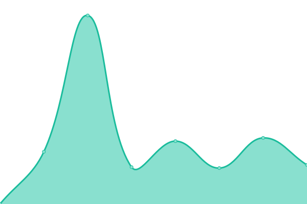
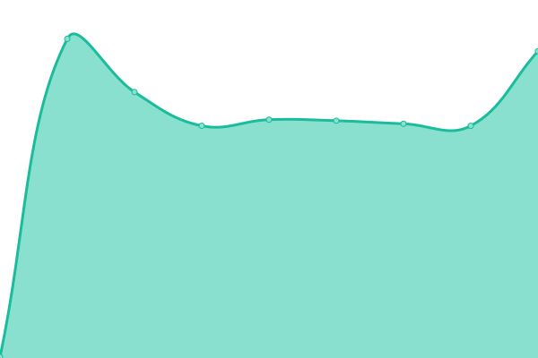
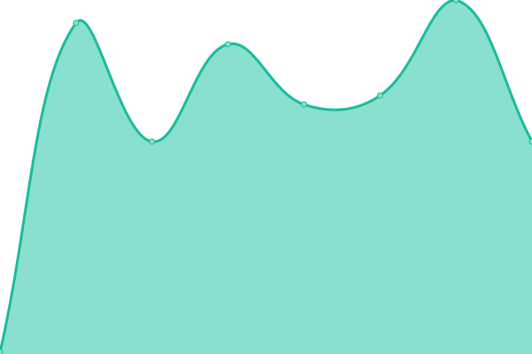
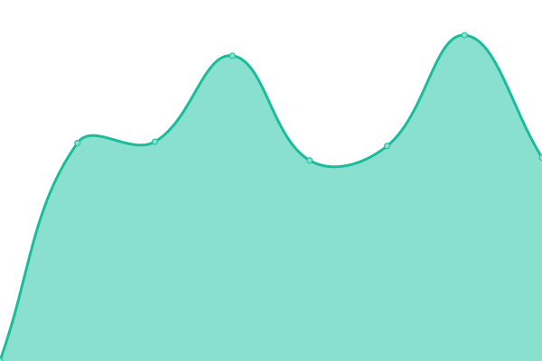

# [📈 Live Status](https://upptime.github.io/upptime): <!--live status--> **🟧 Partial outage**

This repository contains the open-source uptime monitor and status page for [Upptime](https://upptime.js.org), powered by [Upptime](https://github.com/upptime/upptime).

With [Upptime](https://upptime.js.org), you can get your own unlimited and free uptime monitor and status page, powered entirely by a GitHub repository. We use [Issues](https://github.com/upptime/upptime/issues) as incident reports, [Actions](https://github.com/oribisoftware/upptime/actions) as uptime monitors, and [Pages](https://upptime.github.io/upptime) for the status page.

<!--start: status pages-->
<!-- This summary is generated by Upptime (https://github.com/upptime/upptime) -->
<!-- Do not edit this manually, your changes will be overwritten -->
<!-- prettier-ignore -->
| URL | Status | History | Response Time | Uptime |
| --- | ------ | ------- | ------------- | ------ |
|  [Marketing Website (oribi.se)](https://oribi.se) | 🟩 Up | [marketing-website-oribi-se.yml](https://github.com/oribisoftware/upptime/commits/HEAD/history/marketing-website-oribi-se.yml) | 

 974ms
     
 | 

<a href="https://status.oribi.se/history/marketing-website-oribi-se">100.00%</a>
    

|  [Oribi Web Store (oribisoftware.com)](https://oribisoftware.com/en) | 🟩 Up | [oribi-web-store-oribisoftware-com.yml](https://github.com/oribisoftware/upptime/commits/HEAD/history/oribi-web-store-oribisoftware-com.yml) | 

 1043ms
     
 | 

<a href="https://status.oribi.se/history/oribi-web-store-oribisoftware-com">100.00%</a>
    

|  Oribi Web Store / License key server (E-keys) | 🟩 Up | [oribi-web-store-license-key-server-e-keys.yml](https://github.com/oribisoftware/upptime/commits/HEAD/history/oribi-web-store-license-key-server-e-keys.yml) | 

 290ms
     
 | 

<a href="https://status.oribi.se/history/oribi-web-store-license-key-server-e-keys">100.00%</a>
    

|  [Habitat (dl.oribisoftware.com)](https://dl.oribisoftware.com) | 🟩 Up | [habitat-dl-oribisoftware-com.yml](https://github.com/oribisoftware/upptime/commits/HEAD/history/habitat-dl-oribisoftware-com.yml) | 

 1515ms
     
 | 

<a href="https://status.oribi.se/history/habitat-dl-oribisoftware-com">100.00%</a>
    

|  Habitat / License key server (H-keys) | 🟩 Up | [habitat-license-key-server-h-keys.yml](https://github.com/oribisoftware/upptime/commits/HEAD/history/habitat-license-key-server-h-keys.yml) | 

 177ms
     
 | 

<a href="https://status.oribi.se/history/habitat-license-key-server-h-keys">100.00%</a>
    

|  Habitat / Domain name license check | 🟩 Up | [habitat-domain-name-license-check.yml](https://github.com/oribisoftware/upptime/commits/HEAD/history/habitat-domain-name-license-check.yml) | 

 166ms
     
 | 

<a href="https://status.oribi.se/history/habitat-domain-name-license-check">100.00%</a>
    

|  Habitat / School ID license check | 🟩 Up | [habitat-school-id-license-check.yml](https://github.com/oribisoftware/upptime/commits/HEAD/history/habitat-school-id-license-check.yml) | 

 171ms
     
 | 

<a href="https://status.oribi.se/history/habitat-school-id-license-check">100.00%</a>
    

|  TTS (Oribi Speak) | 🟩 Up | [tts-oribi-speak.yml](https://github.com/oribisoftware/upptime/commits/HEAD/history/tts-oribi-speak.yml) | 

 1650ms
     
 | 

<a href="https://status.oribi.se/history/tts-oribi-speak">88.88%</a>
    

|  Word Prediction (Oribi Speak) | 🟩 Up | [word-prediction-oribi-speak.yml](https://github.com/oribisoftware/upptime/commits/HEAD/history/word-prediction-oribi-speak.yml) | 

 686ms
     
 | 

<a href="https://status.oribi.se/history/word-prediction-oribi-speak">100.00%</a>
    

|  Dictionary API | 🟥 Down | [dictionary-api.yml](https://github.com/oribisoftware/upptime/commits/HEAD/history/dictionary-api.yml) | 

 636ms
     
 | 

<a href="https://status.oribi.se/history/dictionary-api">88.90%</a>
    

|  Dictionary API / Available phonfiles | 🟩 Up | [dictionary-api-available-phonfiles.yml](https://github.com/oribisoftware/upptime/commits/HEAD/history/dictionary-api-available-phonfiles.yml) | 

 1285ms
     
 | 

<a href="https://status.oribi.se/history/dictionary-api-available-phonfiles">100.00%</a>
    

|  Spellcheck Service (SkrivaText) | 🟩 Up | [spellcheck-service-skriva-text.yml](https://github.com/oribisoftware/upptime/commits/HEAD/history/spellcheck-service-skriva-text.yml) | 

 232ms
     
 | 

<a href="https://status.oribi.se/history/spellcheck-service-skriva-text">100.00%</a>
    

<!--end: status pages-->

[**Visit our status website →**](https://upptime.github.io/upptime)

## 📄 License

- Powered by: [Upptime](https://github.com/upptime/upptime)
- Code: [MIT](./LICENSE) © [Upptime](https://upptime.js.org)
- Data in the `./history` directory: [Open Database License](https://opendatacommons.org/licenses/odbl/1-0/)
