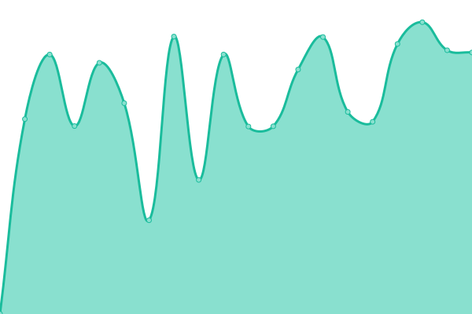

# [📈 Live Status](https://upptime.github.io/upptime): <!--live status--> **Alla servrar snurrar som de ska!**

This repository contains the open-source uptime monitor and status page for [Upptime](https://upptime.js.org), powered by [Upptime](https://github.com/upptime/upptime).

With [Upptime](https://upptime.js.org), you can get your own unlimited and free uptime monitor and status page, powered entirely by a GitHub repository. We use [Issues](https://github.com/upptime/upptime/issues) as incident reports, [Actions](https://github.com/oribisoftware/upptime/actions) as uptime monitors, and [Pages](https://upptime.github.io/upptime) for the status page.

<!--start: status pages-->
<!-- This summary is generated by Upptime (https://github.com/upptime/upptime) -->
<!-- Do not edit this manually, your changes will be overwritten -->
<!-- prettier-ignore -->
| URL | Status | History | Response Time | Uptime |
| --- | ------ | ------- | ------------- | ------ |
|  [Hemsidan (oribi.se)](https://oribi.se) | Uppe | [hemsidan-oribi-se.yml](https://github.com/oribisoftware/upptime/commits/HEAD/history/hemsidan-oribi-se.yml) | 

 302ms
     
 | 

<a href="https://oribisoftware.github.io/upptime/history/hemsidan-oribi-se">100.00%</a>
    

|  [Oribi Web Store (oribisoftware.com)](https://oribisoftware.com/en) | Uppe | [oribi-web-store-oribisoftware-com.yml](https://github.com/oribisoftware/upptime/commits/HEAD/history/oribi-web-store-oribisoftware-com.yml) | 

 1291ms
     
 | 

<a href="https://oribisoftware.github.io/upptime/history/oribi-web-store-oribisoftware-com">100.00%</a>
    

|  [Oribi Habitat (dl.oribisoftware.com)](https://dl.oribisoftware.com) | Uppe | [oribi-habitat-dl-oribisoftware-com.yml](https://github.com/oribisoftware/upptime/commits/HEAD/history/oribi-habitat-dl-oribisoftware-com.yml) | 

 919ms
     
 | 

<a href="https://oribisoftware.github.io/upptime/history/oribi-habitat-dl-oribisoftware-com">100.00%</a>
    

<!--end: status pages-->

[**Visit our status website →**](https://upptime.github.io/upptime)

## 📄 License

- Powered by: [Upptime](https://github.com/upptime/upptime)
- Code: [MIT](./LICENSE) © [Upptime](https://upptime.js.org)
- Data in the `./history` directory: [Open Database License](https://opendatacommons.org/licenses/odbl/1-0/)
