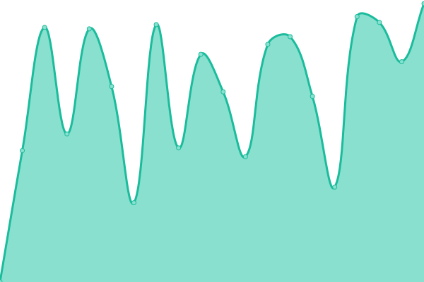

# [📈 Live Status](https://upptime.github.io/upptime): <!--live status--> **🟧 Partial outage**

This repository contains the open-source uptime monitor and status page for [Upptime](https://upptime.js.org), powered by [Upptime](https://github.com/upptime/upptime).

With [Upptime](https://upptime.js.org), you can get your own unlimited and free uptime monitor and status page, powered entirely by a GitHub repository. We use [Issues](https://github.com/upptime/upptime/issues) as incident reports, [Actions](https://github.com/oribisoftware/upptime/actions) as uptime monitors, and [Pages](https://upptime.github.io/upptime) for the status page.

<!--start: status pages-->
<!-- This summary is generated by Upptime (https://github.com/upptime/upptime) -->
<!-- Do not edit this manually, your changes will be overwritten -->
<!-- prettier-ignore -->
| URL | Status | History | Response Time | Uptime |
| --- | ------ | ------- | ------------- | ------ |
|  [Hemsidan (oribi.se)](https://oribi.se) | Uppe | [hemsidan-oribi-se.yml](https://github.com/oribisoftware/upptime/commits/HEAD/history/hemsidan-oribi-se.yml) | 

 944ms
     
 | 

<a href="https://status.oribi.se/history/hemsidan-oribi-se">100.00%</a>
    

|  [Oribi Web Store (oribisoftware.com)](https://oribisoftware.com/en) | Uppe | [oribi-web-store-oribisoftware-com.yml](https://github.com/oribisoftware/upptime/commits/HEAD/history/oribi-web-store-oribisoftware-com.yml) | 

 1152ms
     
 | 

<a href="https://status.oribi.se/history/oribi-web-store-oribisoftware-com">100.00%</a>
    

|  Oribi Web Store / Licensnyckelkontroll (E-nycklar) | Uppe | [oribi-web-store-licensnyckelkontroll-e-nycklar.yml](https://github.com/oribisoftware/upptime/commits/HEAD/history/oribi-web-store-licensnyckelkontroll-e-nycklar.yml) | 

 248ms
     
 | 

<a href="https://status.oribi.se/history/oribi-web-store-licensnyckelkontroll-e-nycklar">100.00%</a>
    

|  [Habitat (dl.oribisoftware.com)](https://dl.oribisoftware.com) | Uppe | [habitat-dl-oribisoftware-com.yml](https://github.com/oribisoftware/upptime/commits/HEAD/history/habitat-dl-oribisoftware-com.yml) | 

 1397ms
     
 | 

<a href="https://status.oribi.se/history/habitat-dl-oribisoftware-com">100.00%</a>
    

|  Habitat / Licensnyckelkontroll (H-nycklar) | Uppe | [habitat-licensnyckelkontroll-h-nycklar.yml](https://github.com/oribisoftware/upptime/commits/HEAD/history/habitat-licensnyckelkontroll-h-nycklar.yml) | 

 164ms
     
 | 

<a href="https://status.oribi.se/history/habitat-licensnyckelkontroll-h-nycklar">100.00%</a>
    

|  Habitat / Licenskontroll av domännamn | Uppe | [habitat-licenskontroll-av-domaennamn.yml](https://github.com/oribisoftware/upptime/commits/HEAD/history/habitat-licenskontroll-av-domaennamn.yml) | 

 158ms
     
 | 

<a href="https://status.oribi.se/history/habitat-licenskontroll-av-domaennamn">100.00%</a>
    

|  Habitat / Licenskontroll av skolenhetskod | Uppe | [habitat-licenskontroll-av-skolenhetskod.yml](https://github.com/oribisoftware/upptime/commits/HEAD/history/habitat-licenskontroll-av-skolenhetskod.yml) | 

 159ms
     
 | 

<a href="https://status.oribi.se/history/habitat-licenskontroll-av-skolenhetskod">100.00%</a>
    

|  TTS (Oribi Speak talsyntes) | Nere | [tts-oribi-speak-talsyntes.yml](https://github.com/oribisoftware/upptime/commits/HEAD/history/tts-oribi-speak-talsyntes.yml) | 

 1275ms
     
 | 

<a href="https://status.oribi.se/history/tts-oribi-speak-talsyntes">93.74%</a>
    

|  TTS / Tillgängliga röster | Nere | [tts-tillgaengliga-roester.yml](https://github.com/oribisoftware/upptime/commits/HEAD/history/tts-tillgaengliga-roester.yml) | 

 195ms
     
 | 

<a href="https://status.oribi.se/history/tts-tillgaengliga-roester">93.75%</a>
    

|  Ordprediktion | Uppe | [ordprediktion.yml](https://github.com/oribisoftware/upptime/commits/HEAD/history/ordprediktion.yml) | 

 657ms
     
 | 

<a href="https://status.oribi.se/history/ordprediktion">100.00%</a>
    

|  Ordboken | Uppe | [ordboken.yml](https://github.com/oribisoftware/upptime/commits/HEAD/history/ordboken.yml) | 

 703ms
     
 | 

<a href="https://status.oribi.se/history/ordboken">100.00%</a>
    

|  Ordboken / Tillgänliga ljudfiler | Uppe | [ordboken-tillgaenliga-ljudfiler.yml](https://github.com/oribisoftware/upptime/commits/HEAD/history/ordboken-tillgaenliga-ljudfiler.yml) | 

 1140ms
     
 | 

<a href="https://status.oribi.se/history/ordboken-tillgaenliga-ljudfiler">100.00%</a>
    

|  Rättstavning | Uppe | [raettstavning.yml](https://github.com/oribisoftware/upptime/commits/HEAD/history/raettstavning.yml) | 

 198ms
     
 | 

<a href="https://status.oribi.se/history/raettstavning">100.00%</a>
    

|  [Mattetecken (Microsoft Word)](https://mattetecken.netlify.app) | Uppe | [mattetecken-microsoft-word.yml](https://github.com/oribisoftware/upptime/commits/HEAD/history/mattetecken-microsoft-word.yml) | 

 110ms
     
 | 

<a href="https://status.oribi.se/history/mattetecken-microsoft-word">100.00%</a>
    

<!--end: status pages-->

[**Visit our status website →**](https://upptime.github.io/upptime)

## 📄 License

- Powered by: [Upptime](https://github.com/upptime/upptime)
- Code: [MIT](./LICENSE) © [Upptime](https://upptime.js.org)
- Data in the `./history` directory: [Open Database License](https://opendatacommons.org/licenses/odbl/1-0/)
